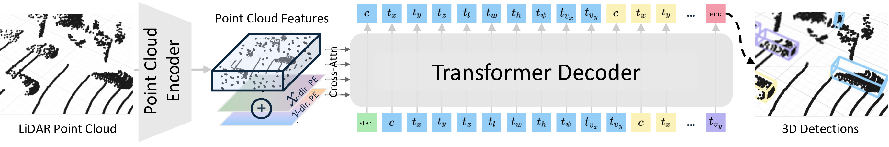

# On the Feasibility and Opportunity of Autoregressive 3D Object Detection

by
[Zanming Huang](https://tzmhuang.github.io/), [Jinsu Yoo](https://jinsuyoo.info/), [Sooyoung Jeon](https://jeonso0907.github.io/), [Zhenzhen Liu](https://zhenzhel.github.io/), [Mark Campbell](https://campbell.mae.cornell.edu/), [Kilian Q Weinberger](https://www.cs.cornell.edu/~kilian/), [Bharath Hariharan](http://home.bharathh.info/), [Wei-Lun Chao](https://sites.google.com/view/wei-lun-harry-chao/home), [Katie Z Luo](https://www.cs.cornell.edu/~katieluo/)

*CVPR 2026 Findings*

[[Project Page](https://tzmhuang.github.io/autoreg3d)] [[arXiv](https://arxiv.org/abs/2603.07985)]



## Overview

**AutoReg3D** reformulates LiDAR-based 3D object detection as an **autoregressive sequence modeling** problem.

Instead of predicting box parameters with a dense detection head, AutoReg3D tokenizes each 3D bounding box into a discrete sequence. A Transformer decoder then generates boxes **one token at a time**, conditioned on bird’s-eye-view (BEV) features.

AutoReg3D achieves competitive performance with leading proposal-based and query-based detectors while using a simpler, unified detection pipeline.

### Key Advantages 🔥

- **Simpler detection pipeline**: removes many hand-designed training and inference components used in conventional 3D detectors.
- **Sequence-modeling capabilities**: enables RL fine-tuning and conditional decoding through cascading refinement.


## Results

All results are for the **AutoReg3D** detector on the **nuScenes validation** set.
Please refer to our paper for more results.

### nuScenes detection performance

AutoReg3D trained with teacher forcing, across backbones.

| Backbone | Precision | Recall | F1 | Config | Checkpoint |
|---|:---:|:---:|:---:|:---:|:---:|
| Pillar Conv. | 69.6 | 52.4 | 59.2 | [config](./tools/cfgs/autoreg3d_models/autoreg3d_conv_pillar.yaml) | [ckpt](https://drive.google.com/file/d/1r0--ok2XusdOeeDDXPFNs3tCtnq4lhqG/view?usp=sharing) |
| Voxel Conv.  | 74.9 | 59.4 | 65.8 | [config](./tools/cfgs/autoreg3d_models/autoreg3d_conv_voxel.yaml) | [ckpt](https://drive.google.com/file/d/1utzfRXVWBg9hqdpqicK81oJIz4W_HQ1e/view?usp=sharing) |
| Transformer  | 77.0 | 64.1 | 69.5 | [config](./tools/cfgs/autoreg3d_models/autoreg3d_transformer.yaml) | [ckpt](https://drive.google.com/file/d/17YvFihGRMBJ3MnVBNtke11CxbCXylYVD/view?usp=sharing) |
| Mamba        | 77.5 | 65.2 | 70.4 | [config](./tools/cfgs/autoreg3d_models/autoreg3d_mamba.yaml) | [ckpt](https://drive.google.com/file/d/1wW1PEMrPOO3wZY2enxbFLsPe-BsjOq_3/view?usp=sharing) |

AutoReg3D is competitive across all backbone types, with notably higher precision
than regression-based detectors on the pillar and voxel backbones.

### RL fine-tuning

GRPO fine-tuning applied to the teacher-forced Voxel Conv. model above.

| Backbone | Training | Precision | Recall | F1 | Config | Checkpoint |
|---|---|:---:|:---:|:---:|:---:|:---:|
| Voxel Conv. | Teacher Forcing + GRPO | 74.5 | 60.9 | 66.7 | [config](./tools/cfgs/autoreg3d_models/autoreg3d_conv_voxel_rl.yaml) | [ckpt](https://drive.google.com/file/d/1B1gzqOM00sMEmWl3YZwL_2q9BxgaeSL2/view?usp=sharing) |

Relative to the teacher-forced Voxel Conv. model, GRPO improves F1 through higher recall,
reflecting task-aligned optimization.

## Installation

Please refer to [docs/INSTALL.md](docs/INSTALL.md) for installation.

## Getting Started

### Data Preparation

This release uses **nuScenes**. See [docs/GETTING_STARTED.md](docs/GETTING_STARTED.md)
for dataset download, directory layout, and info generation.

### Pre-trained backbone

We use pre-trained backbone in following public repos, with the exact model config linked below. The model checkpoints can be found in the respective repos.

| Backbone | Link |
|---|:---:|
| Pillar Conv. | [OpenPCDet](https://github.com/open-mmlab/OpenPCDet/blob/master/tools/cfgs/nuscenes_models/cbgs_dyn_pp_centerpoint.yaml) |
| Voxel Conv.  | [OpenPCDet](https://github.com/open-mmlab/OpenPCDet/blob/master/tools/cfgs/nuscenes_models/cbgs_voxel0075_res3d_centerpoint.yaml) |
| Transformer  | [DSVT](https://github.com/Haiyang-W/DSVT/blob/master/tools/cfgs/dsvt_models/dsvt_plain_1f_onestage_nusences.yaml) |
| Mamba        | [LION](https://github.com/happinesslz/LION/blob/main/tools/cfgs/lion_models/lion_mamba_nusc_8x_1f_1x_one_stride_128dim.yaml) |


### Training

All commands are run from the `tools/` directory. AutoReg3D model configs are in
[tools/cfgs/autoreg3d_models](tools/cfgs/autoreg3d_models). `scripts/dist_train.sh <NUM_GPUS> ...`
wraps `train.py` for multi-GPU (DDP) training; for a single GPU, call `python train.py ...` directly.

**Teacher-forcing training**

```bash
cd tools
bash scripts/dist_train.sh 4 \
    --cfg_file <CONFIG_FILE> \
    --pretrained_backbone_model <PRETRAINED_BACKBONE> \
    --use_amp --sync_bn
```

**RL fine-tuning**

RL fine-tuning starts from a trained teacher-forcing checkpoint (`--pretrained_model`) and uses the RL config:

```bash
cd tools
bash scripts/dist_train.sh 4 \
    --cfg_file <CONFIG_FILE> \
    --pretrained_model <PRETRAINED_MODEL> \
    --use_amp --sync_bn
```

### Evaluation

**Greedy sampling**
```bash
cd tools

python test.py \
    --cfg_file <CONFIG_FILE> \
    --ckpt <CKPT> 
```

**Cascading refinement**

The completion model (trained with a random token-ordering objective) is available as
[config](./tools/cfgs/autoreg3d_models/autoreg3d_conv_voxel_random.yaml) and
[ckpt](https://drive.google.com/file/d/1OCsVl0iavMv0_HQfmVjVwkuwgyIoDtNb/view?usp=sharing). Place the checkpoint at `../ckpts/autoreg3d_conv_voxel_random.pth`
and run:

```bash
cd tools

python eval_cascade.py \
    --prior_cfg_file cfgs/autoreg3d_models/autoreg3d_conv_voxel.yaml \
    --prior_ckpt ../ckpts/autoreg3d_conv_voxel.pth \
    --completion_cfg_file cfgs/autoreg3d_models/autoreg3d_conv_voxel_random.yaml \
    --completion_ckpt ../ckpts/autoreg3d_conv_voxel_random.pth
```


## Citation

If you find this work useful, please cite:

```bibtex
@inproceedings{huang2026autoreg3d,
  title     = {On the Feasibility and Opportunity of Autoregressive 3D Object Detection},
  author    = {Huang, Zanming and Yoo, Jinsu and Jeon, Sooyoung and Liu, Zhenzhen and Campbell, Mark
               and Weinberger, Kilian Q and Hariharan, Bharath and Chao, Wei-Lun and Luo, Katie Z},
  booktitle = {CVPR Findings},
  year      = {2026}
}
```

## Acknowledgements

This project is built on [OpenPCDet](https://github.com/open-mmlab/OpenPCDet). We thank the great works and their open-source contribution: [OpenPCDet](https://github.com/open-mmlab/OpenPCDet), [LION](https://github.com/happinesslz/LION), [DSVT](https://github.com/Haiyang-W/DSVT/), [transformers](https://github.com/huggingface/transformers), and [TRL](https://github.com/huggingface/trl).
